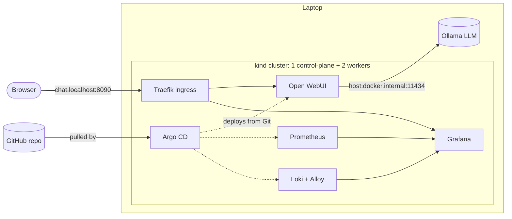

# AI Platform

A self-hosted AI platform on Kubernetes, built 100% with free and open-source
tools. Everything is code: the cluster is created with Terraform, and every
application is deployed from this repository by Argo CD (GitOps).

**Why:** organizations that handle sensitive data (legal, healthcare) often
cannot send it to external LLM APIs. This platform shows how to run LLM
applications on infrastructure you control, with deployment, monitoring and
logging done properly.

## Architecture



## Layers (who owns what)

| Layer | Tool | What it manages |
|---|---|---|
| 1. Infrastructure | Terraform (`infra/`) | The kind cluster |
| 2. Platform | Terraform + Helm (`platform/`) | Traefik, Argo CD |
| 3. Applications | Argo CD (`gitops/`, `apps/`) | Observability, metrics-server, Open WebUI, demo app |

Terraform builds what GitOps needs in order to exist. Argo CD owns everything
else. See `docs/adr/` for the reasoning behind each decision.

## Stack

Terraform, kind, Traefik, Argo CD (app-of-apps), kube-prometheus-stack
(Prometheus, Alertmanager, Grafana), Loki, Grafana Alloy, metrics-server,
Open WebUI, Ollama (on the host).

## Requirements

- Docker Desktop with **at least 8 GB of memory** allocated (10 GB recommended)
- Terraform >= 1.6, kubectl, git
- Ollama installed on the host with a model pulled

## Quick start

```bash
# 1. Cluster
cd infra/local
terraform init && terraform apply
export KUBECONFIG=$(terraform output -raw kubeconfig_path)
kubectl get nodes

# 2. Platform (Traefik + Argo CD)
cd ../../platform
terraform init && terraform apply

# 3. Hand Git over to Argo CD (one-time)
cd ..
kubectl apply -f gitops/root-app.yaml
```

Then open (ports are set in `infra/local/terraform.tfvars`):

- Argo CD: http://argocd.localhost:8090
- Grafana: http://grafana.localhost:8090
- Chat UI: http://chat.localhost:8090

Manual step: the Grafana admin secret is created by hand (planned to be
replaced by Sealed Secrets).

```bash
kubectl create namespace monitoring
kubectl create secret generic grafana-admin -n monitoring \
  --from-literal=admin-user=admin --from-literal=admin-password='<choose one>'
```

## Troubleshooting log (real incidents)

| Symptom | Root cause | Fix |
|---|---|---|
| Cluster creation failed, Docker exit code 125 | Host port 8080 already in use | Made ports configurable per environment |
| Traefik update hung for 10 minutes | Old pod held hostPorts 80/443 on the only allowed node; default rolling update waits for the new pod first | `maxSurge: 0`, `maxUnavailable: 1` |
| Argo CD showed "Synced" but new apps never appeared | Files were committed in `platform/gitops/` instead of `gitops/` | Moved with `git mv`; learned `git ls-tree` prints paths relative to the current folder |
| Argo CD pods restarting, probes timing out | Docker had 3.8 GB total, shared with other projects: memory thrashing | Stopped other workloads, gave Docker 10 GB |
| Grafana permanently OutOfSync | Chart generated a random password on every render, changing a checksum | Fixed admin secret created outside Git |
| whoami "Progressing" forever | Ingress had no address on a laptop (no cloud load balancer) | Traefik publishes `127.0.0.1` as the Ingress address |

## Roadmap

- [x] Terraform-provisioned cluster, Traefik, Argo CD (GitOps)
- [x] Metrics, logs, dashboards
- [x] Chat UI on a local LLM
- [ ] CI pipeline (validate, scan, build)
- [ ] Own application (RAG contract assistant) deployed through CI/CD
- [ ] Custom metrics, dashboard and alerts
- [ ] Sealed Secrets, Kyverno policies
- [ ] AI-assisted incident diagnosis
- [ ] Autoscaling (KEDA), backups (Velero)

## Repository layout

```
infra/modules/   reusable Terraform modules
infra/local/     the laptop environment
platform/        Terraform: Traefik + Argo CD
gitops/          Argo CD root app + one Application per app
apps/            Kubernetes manifests of the applications
docs/adr/        architecture decision records
```
